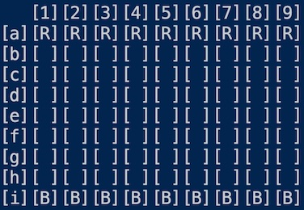

# Hasami Shogi

This was a portfolio project created for my CS162 class. The original assignment was to create a version of the board game Hasami Shogi using the rules for [Variant 1](https://en.wikipedia.org/wiki/Hasami_shogi). The game would be played using "algebraic notation", with rows labeled a-i and columns labeled 1-9. We were given a few specific getter methods that needed to be included, otherwise any implementation of the game was allowed.

I created my version of the game using four classes: the board, the squares on the board, the pieces and the game itself. The board object was created as a list of lists. The most challenging parts of the project were accounting for literal corner cases for corner captures and validated each move. 

Overall it was a very fun project! My original game looked like this:

After the class concluded, I chose to add onto the game by creating a GUI version with pygame. My goals for the first version were:

- Draw the board
- Draw the pieces in the correct place on the board
- Move piece to new square with two mouse clicks
- Have pieces disappear when captured

The project had a few challenges. The biggest challenge was implementing the mouse click logic as two separate clicks needed to be captured. I solved this by creating a move_state data member to the game class, which allowed mouse clicks to be differentiated. Here is a gif of the game in it's current state:

I want to continue to work on the project. My next steps are:

- Add more visual cues including:
    * Highlighting selected square
    * Coloring squares that are valid to move to
    * Text indicating current player's turn
- Allow user to unselect piece they previously selected
- Create messages for the start and the end of the game
- Allow user to restart game without quitting the window